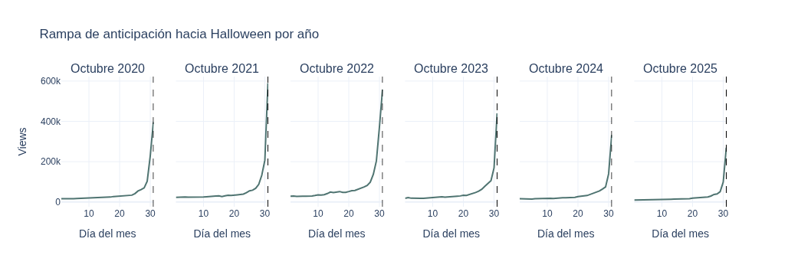

## ¿Qué predecimos?

Vistas diarias del artículo **Halloween** en Wikipedia (en inglés),  
del **1 al 31 de octubre 2025**.

- Serie con spike extremo el 31-oct (~270k views vs ~8k normales)
- 4 Halloweens disponibles en train (2022–2024)
- Forecast **recursivo**: cada predicción alimenta la siguiente ventana

---

## Datos y features

| Variable | Correlación | Justificación |
|---|---|---|
| `es_halloween` | $0.739$ | Spike del 31-oct |
| `semana_halloween` | $0.611$ | Rampa oct 24-30 |
| `dias_para_halloween` | $-0.242$ | Pearson engañoso — rampa real |
| `views_lag7` | $0.213$ | Memoria de corto plazo |

---

## Split temporal

```
Train:  2022-01-01 → 2024-09-30   (~1003 días)
Val:    2024-10-01 → 2024-10-31   (31 días — Octubre 2024)
Test:   2025-10-01 → 2025-10-31   (31 días — Octubre 2025)
```

::: {.callout-note}
Val contiene un Halloween completo para que el Early Stopping  
optimice sobre el evento de interés, no sobre días planos.
:::

---

## Halloween, a lo largo de los años
```{=html}

</img>
```

---

## Arquitecturas

:::: {.columns}

::: {.column width="50%"}
**FFNN**

- `Flatten` → `Dense(64, ReLU)`
- `Dropout(0.2)`
- `Dense(32, ReLU)`
- `Dense(1)`
- Ventana: W=30 días aplanada
:::

::: {.column width="50%"}
**LSTM**

- `LSTM(32, dropout=0.3, recurrent_dropout=0.2)`
- `Dense(16, ReLU)`
- `Dropout(0.2)`
- `Dense(3)`
- Ventana: W=30 días en secuencia
:::

::::

---

## Arquitecturas 2
::::: {.columns}
::: {.column width="100%"}
**Ensamble**
- Combinación sencilla de los resultados de los modelos. Se suman ambos y se dividen entre 2

:::
::::

---

## Curvas de pérdida

```{=html}
<iframe src="Assets/curvas_perdida.html"
        width="100%" height="450px"
        frameborder="0" scrolling="no">
</iframe>
```

---

## Forecast Recursivo, Halloweeen 2025
```{=html}
<iframe src="Assets/forecast_ensamble_3.html"
        width="100%" height="450px"
        frameborder="0" scrolling="no">
</iframe>
```
Prueba del modelo con datos ya conocidos

---

## Métricas de Rendimiento
| Modelo | MAE | RMSE | MAPE (%)
| --- | --- | --- | --- |
| `FFNN` | $7375.39$ | $10111.30$ | $34.02$
| `LSTM` | $3377.65$ | $6825.92$ | $12.32$

El modelo LSTM es considerablemente mejor en todas las métricas a comparación del FFNN. La LSTM logra capturar mejor la dinámica temporal de la serie y la aceleración de Halloween.

---

## Errores Acumulados
```{=html}
<iframe src="Assets/errores_acumulados_2.html"
        width="100%" height="450px"
        frameborder="0" scrolling="no">
</iframe>
```
Error en el spike (31-oct 2025):
  FFNN: 35,037 views
  LSTM: 8,184 views

Error promedio dias normales (1-30 oct):
  FFNN: 6,453 views
  LSTM: 3,217 views

---

## Predicciónes a Futuro, 2026 y 2027
```{=html}
<iframe src="Assets/predicciones_halloween_2.html"
        width="100%" height="450px"
        frameborder="0" scrolling="no">
</iframe>
```

---

## Análisis de Predicciones

- Respetan el comportamiento histórico, sin exceder el rango típico de spikes anteriores
- Captan la tendencia a la alta que ha mostrado en años recientes
- FFNN sigue dando predicciones más altas, LSTM sigue siendo más conservador
- El LSTM es incluso mejor que el modelo ensamble

---

## Conclusiones

- Este proyecto tenía el problema principal de tener una serie muy regular con un pico muy desproporcional cada año
- Ayudó mucho que este pico es uno perfectamente predecible y conocido
- La transformación logarítmica sirvió mucho para que la serie también aprendiera el comportamiento general de la serie el resto del año
- Las variables exógenas fueron fundamentales para ayudar a las redes neuronales a comprender el por qué del comportamiento de la serie